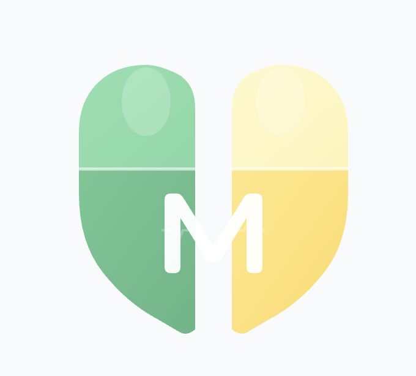

<div align="center">



# medie-ai-agent

복약 관리 앱 매디(MEDI)의 AI 에이전트 백엔드 — 음성 명령으로 복약 기록·알람·화면 제어까지 수행하는 **행동형 AI Agent**

🏆 **Microsoft AI Engineer 3기 파이널 프로젝트 우수상**

<br/>


</div>

> **이 저장소는 MEDI 프로젝트의 AI 에이전트 백엔드입니다.** 음성 입력(STT)은 React Native 클라이언트에서 텍스트로 변환되어 `/chat`으로 전달되며, IoT 약통 펌웨어·모바일 앱·연동 백엔드(`/arduino`, `/boards`)는 별도 저장소로 구성됩니다.

사용자의 복약을 돕고, 음성/채팅으로 앱 기능을 제어하며, IoT 약통 데이터를 실시간으로 모니터링합니다.
FastAPI + LangGraph 기반이며, Azure OpenAI를 LLM으로 사용합니다.

## 배경 (Problem)

- 만성질환자의 복약 불이행률은 **50% 이상**. 보호자가 매번 확인할 수 없고, 환자 본인도 복약 여부를 기억하지 못합니다.
- 기존 알람 앱은 **울리기만 할 뿐, 실제로 약을 먹었는지는 알 수 없습니다.**

## 접근 (Solution)

- **행동형 Agent** — 대화 결과가 DB 기록·알람 변경·앱 화면 이동 같은 **실제 동작**으로 이어지도록 **LangGraph StateGraph**로 설계
- **IoT 무게 센서로 실제 복용 감지** — 약통 무게 변화를 Azure Blob Storage로 수집·분석해 "알람"이 아니라 **"실제 복용"** 을 확인
- **할루시네이션 구조적 차단** — 식약처 공식 데이터만 컨텍스트로 주입하는 **가드레일 RAG**로 의료 정보 오답 방지

## 데모

<!-- 앱 스크린샷 / 시연 GIF 를 assets/ 에 넣고 아래 주석을 해제하세요 -->
<!--  -->

_스크린샷·시연 영상 추가 예정_

## 주요 기능

- **대화형 에이전트**: 사용자 메시지의 의도를 분류해 화면 이동, 복약 완료, 알람 설정, 약 검색 등 앱 동작을 제어
- **IoT 실시간 모니터링**: Azure Blob Storage에 쌓이는 약통(무게 센서) 데이터를 백그라운드 스레드가 30초마다 확인해 복약 여부를 판단
- **RAG 기반 약 정보 (할루시네이션 가드레일)**: 식약처(MFDS) 공개 API로 조회한 약품 정보를 ChromaDB에 저장하고 유사도 검색으로 답변. **공식 데이터만 컨텍스트로 주입**해 의료 정보 할루시네이션을 구조적으로 차단
- **복약 패턴 분석**: 최근 복약 이력의 평균 시간을 계산해 알람 시간 자동 조정을 제안
- **음성 커뮤니티 작성**: 음성 명령으로 커뮤니티 게시글 초안 작성·등록 (`WRITE_POST` / `POST_SUBMIT`)
- **푸시 알림**: Expo Push를 통해 복약 시간 알림 및 약통 움직임 감지 알림 전송
- **TTS**: ElevenLabs를 이용한 매디 음성 응답 생성

## 아키텍처

```
        ┌─────────────┐        ┌──────────────────────────────┐
IoT 약통 │ Azure Blob   │ ─────▶ │ background_monitoring (30초)   │
         │ Storage      │        │  (main.py, 데몬 스레드)         │
         └─────────────┘        └──────────────┬───────────────┘
                                                │
앱/클라이언트 ──── POST /chat ───────────────────▼
                                    ┌────────────────────────┐
                                    │ LangGraph Agent (매디)   │
                                    │  agent/graph.py         │
                                    └───────────┬────────────┘
                                                │
   monitor_iot → analyze_schedule → classify_intent → (의도별 노드) → END
                                                │
                    ┌───────────────────────────┼───────────────────────────┐
                    ▼                            ▼                           ▼
              Azure OpenAI               식약처 API + ChromaDB         백엔드 서버
              (LLM/임베딩)                    (RAG)                  (/arduino, /boards ...)
```

### LangGraph 그래프 흐름

1. `monitor_iot` — Azure Blob Storage에서 최신 IoT 데이터 로드 (사용자 메시지가 있으면 스킵)
2. `analyze_schedule` — 복약 스케줄 확인
3. `classify_intent` — 빠른 규칙 + LLM으로 의도 분류
4. 의도별 노드로 조건부 라우팅 후 종료

**의도(Intent) 종류**: `NAVIGATE`, `COMPLETE_DOSE`, `SET_ALARM`, `TOGGLE_ALL_ALARMS`, `DELETE_ALL_ALARMS`, `IOT_EVENT`, `SEARCH_DRUG`, `WRITE_POST`, `POST_SUBMIT`, `CHECK_HISTORY`, `DRUG_INFO`, `CHAT`

## 프로젝트 구조

```
medie-ai-agent/
├── main.py                 # FastAPI 앱 진입점, 라우트 + 백그라운드 모니터링 스레드
├── agent/
│   ├── graph.py            # LangGraph 에이전트 (상태·노드·라우팅·외부 전송)
│   ├── prompts.py          # 매디 시스템 프롬프트 (화면/커맨드 정의)
│   ├── rag.py              # 식약처 API 조회 + ChromaDB 저장/검색
│   └── monitoring.py       # 로컬 실행용 IoT 모니터링 스크립트 (독립 실행)
├── app/
│   └── api/
│       └── tts.py          # ElevenLabs TTS 라우터 (POST /tts)
├── core/
│   └── config.py           # pydantic-settings 기반 환경설정 (.env 로드)
├── Tools/
│   └── pill_check.py       # Cosmos DB 약통 무게 상태 조회 유틸
├── requirements.txt
└── .github/workflows/      # Azure Web App 배포 CI/CD
```

## 요구 사항

- Python 3.11
- Azure OpenAI (챗 모델 배포 + `text-embedding-ada-002`)
- Azure Blob Storage, Azure Cosmos DB
- 식약처(MFDS) 공개 API 키
- (선택) ElevenLabs API 키

## 환경 변수 (`.env`)

`core/config.py`가 로드하는 설정 값입니다.

| 변수 | 필수 | 설명 |
|------|:---:|------|
| `AZURE_OPENAI_ENDPOINT` | ✅ | Azure OpenAI 엔드포인트 |
| `AZURE_OPENAI_API_KEY` | ✅ | Azure OpenAI API 키 |
| `AZURE_OPENAI_DEPLOYMENT_NAME` | ✅ | 챗 모델 배포 이름 |
| `AZURE_OPENAI_API_VERSION` | ✅ | API 버전 |
| `AZURE_STORAGE_CONNECTION_STRING` | ✅ | IoT 데이터가 저장되는 Blob Storage 연결 문자열 |
| `COSMOS_CONNECTION_STRING` | ✅ | Cosmos DB 연결 문자열 |
| `JWT_SECRET_KEY` | ✅ | JWT 시크릿 키 |
| `DRUG_API_KEY` | | 식약처 API 서비스 키 |
| `DRUG_API_ENDPOINT` | | 식약처 API 엔드포인트 |
| `ELEVENLABS_API_KEY` | | ElevenLabs API 키 (TTS) |
| `ELEVENLABS_VOICE_ID` | | ElevenLabs 보이스 ID |
| `ELEVENLABS_MODEL_ID` | | 기본값 `eleven_multilingual_v2` |
| `BACKEND_URL` | | 연동 백엔드 URL (기본 `http://localhost:8000`) |
| `DEFAULT_USER_ID` | | 기본 사용자 ID (기본 `User_01`) |
| `CHROMA_PATH` | | ChromaDB 저장 경로 (기본 `./chroma_db`) |

## 실행 방법

```bash
# 가상환경 생성 및 의존성 설치
python -m venv .venv
source .venv/bin/activate
pip install -r requirements.txt

# .env 파일 작성 후 서버 실행 (포트 8001)
python main.py
# 또는
uvicorn main:app --host 0.0.0.0 --port 8001 --reload
```

로컬에서 IoT 모니터링만 단독 테스트하려면:

```bash
python -m agent.monitoring
```

## API 엔드포인트

| 메서드 | 경로 | 설명 |
|--------|------|------|
| `POST` | `/chat` | 사용자 메시지 처리 (메인 에이전트 진입점) |
| `POST` | `/tts` | 텍스트 → 음성 변환 (ElevenLabs) |
| `POST` | `/push-token` | Expo 푸시 토큰 등록 |
| `POST` | `/alarm-time` | 사용자 알람 시간 저장 |
| `GET`  | `/alarm-time/{user_id}` | 알람 시간 조회 |
| `POST` | `/webhook/weight-log` | IoT 약통 무게 감지 웹훅 |
| `GET`  | `/health` | 헬스 체크 |

### `/chat` 요청 예시

```json
{
  "message": "타이레놀 부작용 알려줘",
  "current_mode": "HOME",
  "user_id": "User_01",
  "pill_history": [],
  "chat_history": [],
  "last_confirmed_timestamp": ""
}
```

### `/chat` 응답 예시

```json
{
  "reply": "타이레놀은 ...",
  "command": "NONE",
  "target": "NONE",
  "show_confirmation": false,
  "params": {},
  "pill_history": [],
  "last_confirmed_timestamp": ""
}
```

## 배포

`main` 브랜치에 push하면 GitHub Actions(`.github/workflows/main_medie-agent-final.yml`)가
Azure Web App **medie-agent-final**(Production 슬롯)로 자동 배포합니다.

## 라이선스

[LICENSE](LICENSE) 참고.
